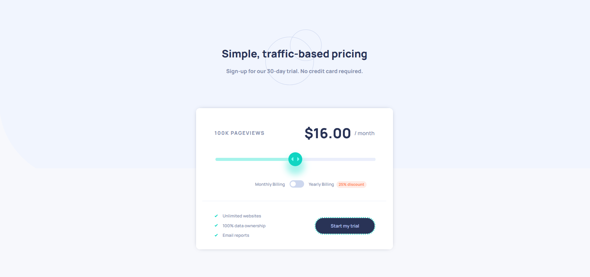

# Frontend Mentor - Interactive pricing component solution

This is a solution to the [Interactive pricing component challenge on Frontend Mentor](https://www.frontendmentor.io/challenges/interactive-pricing-component-t0m8PIyY8).

## Table of contents

- [Overview](#overview)
  - [The challenge](#the-challenge)
  - [Screenshot](#screenshot)
  - [Links](#links)
- [My process](#my-process)
  - [Built with](#built-with)
  - [What I learned](#what-i-learned)
  - [Continued development](#continued-development)
  - [Useful resources](#useful-resources)
- [Author](#author)

## Overview

### The challenge

Users should be able to:

- View the optimal layout for the app depending on their device's screen size
- See hover states for all interactive elements on the page
- Use the slider and toggle to see prices for different page view numbers

### Screenshot

### Links

- Solution URL: [https://github.com/by-yee/interactive-pricing-component-main](https://github.com/by-yee/interactive-pricing-component-main)
- Live Site URL: [https://by-yee.github.io/interactive-pricing-component-main/](https://by-yee.github.io/interactive-pricing-component-main/)

## My process

### Built with

- Semantic HTML5 markup
- CSS custom properties
- Flexbox
- Mobile-first workflow
- [React](https://reactjs.org/) - JS library

### What I learned
In this challenge, I had successfully import the `scss` files into `App.js` by using `npm install sass`. After import there is not necessary to compile the scss to css, when execute `npm start` the scss changes will be reflect immediately.

But there is some issue to the image path (`background-image: url('./path')`) that included in scss. Based on the `Create React App` documentation, images is encourage to stored in `public` folder, but `App.js` that placed in `src` folder failed to resolve the images if is outside of the `src` folder. 

The quick fixed that I did for now is moving the images files over to `src` folder. This is one of the method that some of the developers mentioned in the github issue below. 👇

More info refer -> [https://github.com/facebook/create-react-app/issues/9937](https://github.com/facebook/create-react-app/issues/9937)

### Continued development
In my next challenge, I would like to try on using `Style Component` in react to style my CSS in JS.

### Useful resources

- [Create React App](https://create-react-app.dev/) - This document helps me a lot as a beginner to build a SPA react enviroment.
- [w3schools](https://www.w3schools.com/howto/howto_js_rangeslider.asp) - This page gives me some idea on how to create customize html range slider.

## Author

- Frontend Mentor - [@by-yee](https://www.frontendmentor.io/profile/by-yee)
